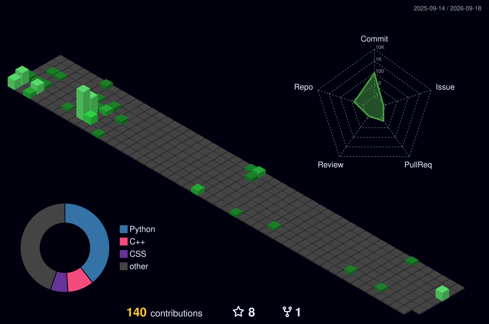

  

 

## 💫 About Me

- 🎓 Pursuing a **Master of Computer Applications (MCA)** at **Delhi University**
- 💡 Passionate about creating **responsive, user-friendly web applications**
- ⚡ Focused on **React** and modern frontend development
- 🌱 Continuously expanding my knowledge of modern web technologies
- 🤝 Open to **collaborations** and **new opportunities**

 

<!-- 

<table>
  <tr>
    <td><b>&nbsp;🔭 Building&nbsp;</b></td>
    <td>&nbsp;<b>FocusLog</b>, a web app built with React + Vite&nbsp;</td>
  </tr>
  <tr>
    <td><b>&nbsp;🌐 Portfolio&nbsp;</b></td>
    <td>&nbsp;<a href="https://sabyasachigorai.github.io/portfolio2.0/">sabyasachi</a>&nbsp;</td>
  </tr>
  <tr>
    <td><b>&nbsp;💬 Ask me about&nbsp;</b></td>
    <td>&nbsp;React · JavaScript · Tailwind CSS · C++&nbsp;</td>
  </tr>
  <tr>
    <td><b>&nbsp;📫 Reach me&nbsp;</b></td>
    <td>&nbsp;<a href="mailto:icis.sabyasachi@gmail.com">icis.sabyasachi@gmail.com</a>&nbsp;</td>
  </tr>
</table>

  -->

## 🛠️ Technologies

<table>
  <tr>
    <th align="left">&nbsp;Technologies</th>
  </tr>
  <tr>
    <td>
      
    </td>
  </tr>
</table>

 

## 📈 GitHub Stats

<table>
  <tr>
    <td align="center" valign="middle">
      
    </td>
    <td align="center" valign="middle">
      
    </td>
  </tr>
  <tr>
    <td colspan="2" align="center">
      
    </td>
  </tr>
</table>

 

<!-- 
 -->

<!--  -->

<!-- 
 -->

 

### ✨ Thanks for visiting! ✨

